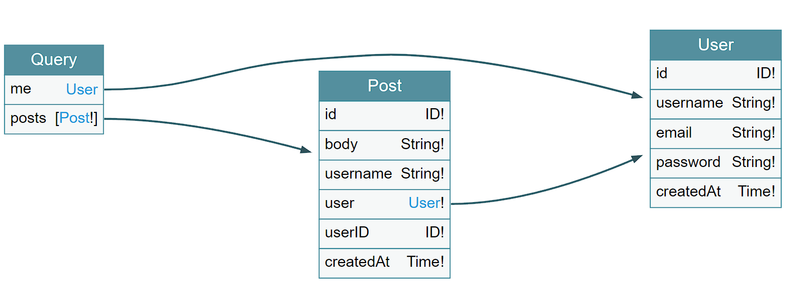

<h1 align="center">Social Network GraphQL API</h1>

<p align="center">
 <a href="#features">Features</a> • 
 <a href="#how-to-run">How to run</a> • 
 <a href="#tests">Tests</a> • 
 <a href="#author">Author</a>
</p>

<p align="center" id="description">Social Network API based on Twitter using <a href="https://graphql.org">GraphQL</a></p>



## Features

- Create a account
- Login to a account
- Create posts
- Reply to posts
- Delete posts

## How to run

### On Docker

#### Requirements

- [Docker compose](https://docs.docker.com/compose/install)

- [Make](https://www.gnu.org/software/make/#download)

1. Clone the project.

```bash
git clone https://github.com/RianNegreiros/go-graphql-api.git
```

2. Run with Docker

```bash
make run-docker
```

Access the GraphQL playground on [localhost:8080](http://localhost:8080)

## Tests

### Unit tests

```bash
make test
```

### Integration tests

1. Setup `.env.test`

2. Setup database for tests. You can use the docker compose, running
`
```bash
docker-compose up test_db -d
```

2. Run the tests

```bash
make test-integration
```

### Manual Tests

[](https://insomnia.rest/run/?label=Go%20GraphQL%20API&uri=https%3A%2F%2Fraw.githubusercontent.com%2FRianNegreiros%2Fgo-graphql-api%2Fmain%2F_docs%2FInsomnia_2023-09-05.json)

### Author

Rian Negreiros Dos Santos

[](https://www.linkedin.com/in/riannegreiros/) 

[](mailto:riannegreiros@gmail.com)
